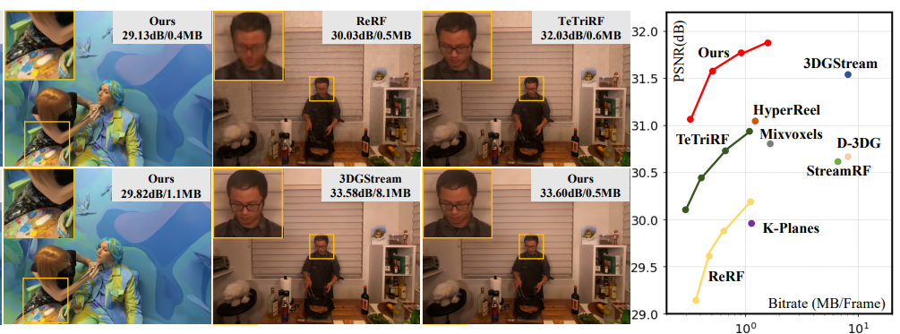

---
# Leave the homepage title empty to use the site title
title:
date: 2022-10-24
type: landing

sections:
  - block: contact
    content:

      text: |-

        <head>
          <meta charset="UTF-8" />
          <meta name="viewport" content="width=device-width, initial-scale=1.0"/>
          <title>MediaX Lab @ SJTU</title>
          
        </head>
        <body>

          <h1><strong>Welcome to MediaX@SJTU (上交智能媒体组)</strong></h1>

          

            <strong>MediaX</strong> is a research group under the <a href="https://cmic.sjtu.edu.cn/CN/Default.aspx">Cooperative Medianet Innovation Center</a> at Shanghai Jiao Tong University, focusing on cutting-edge research at the intersection of computer vision, machine learning, and generative intelligent media. We aim to advance the frontiers of multi-modal media (2D/3D/4D) across generation, restoration and enhancement, reconstruction and compression, and quality assessment. Our mission is to build intelligent systems capable of understanding, modeling, and manipulating complex human-centric visual content, enabling the high-quality and efficient creation of next-generation intelligent media.
          

          <h2>🎯 Research Focus</h2>

          <ul>
            <li>
              <strong>Media Perception & Quality Assessment</strong> 
              Developing intelligent, multi-dimensional evaluation systems for UGC, PGC, and AIGC content.
            </li>
            <li>
              <strong>Video Restoration & Generation</strong> 
              Enhancing, controllably generating and editing 4K/8K video content.
            </li>
            <li>
              <strong>3D/4D Reconstruction & Generation</strong> 
              Leveraging 3DGS and GenAI for efficient representation and compression of immersive dynamic scenes.
            </li>
            <li>
              <strong>Intelligent Media Creation Platform</strong> 
              Building collaborative, multi-agent systems for automated and interactive media production.
            </li>
          </ul>

          <h2>📢 Join Us</h2>
          

            We are always looking for <strong>self-motivated PhD students, Master's students, and undergraduate RA</strong> to join our team. 
            If you're passionate about intelligent media and generative AI, please send your <strong>CV and transcript</strong> to: <em>mediax@sjtu.edu.cn</em>
          

          <a href="mailto:mediax@sjtu.edu.cn" target="_blank">
          <i class="fas fa-envelope"></i> 联系我们
          </a>

          <a href="https://github.com/MediaX-SJTU" target="_blank">
              <i class="fab fa-github"></i> GitHub
          </a>

          <a href="https://notes.sjtu.edu.cn/s/9NKUMusdX" target="_blank">
              <i class="fab fa-weixin"></i> 微信
          </a>
        </body>

    design:
        columns: '1'

  - block: contact
    content:

      text: |-

        <html lang="en">
        <head>
            <meta charset="UTF-8">
            <meta name="viewport" content="width=device-width, initial-scale=1.0">
            <title>News</title>
            
        </head>
        <body>
            <h1>🔥 News</h1>
            
[2025/6]   Two paper is accepted to ICCV 2025

            
[2025/5]   One paper is accepted to ICML 2025

            
[2025/3]   Two paper is accepted to ICME 2025

            
[2025/2]   Two paper is accepted to CVPR 2025

            
[2025/2]   NTIRE 2025 XGC Quality Assessment Challenge Organizer

            
[2025/1]   One paper is accepted to JSAC 2025

            
[2024/12]  One paper is accepted to AAAI 2025

            
[2024/7]   One paper is accepted to TCSVT 2024

            
[2024/7]   One paper is accepted to ACM MM 2024

            
[2024/6]   One paper is accepted to ICIP 2024

            
[2024/3]   One paper is accepted to ICME 2024

            
[2024/2]   One paper is accepted to CVPR 2024

            
[2023/12]  One paper is accepted to AAAI 2024

            
[2023/6]   One paper is accepted to ICCP 2023

            
[2023/3]   One paper is accepted to CVPR 2023

        </body>
        </html>
      
    design:
        columns: '1'

  - block: contact
    content:
      title: Publications
      text: |-

        

        <!-- 核心：表格布局（左右两栏） -->
        <table class="paper-table">
          <tr>
            <!-- 左侧：图片单元格（固定宽度400px，响应式自适应） -->
            <td style="width: 400px; max-width: 100%;">
              
            </td>
            <!-- 右侧：论文信息单元格（自适应剩余宽度） -->
            <td> <!-- 移除原padding-top:10px，保持垂直居中 -->
              <!-- 1. 论文标题（含CVPR Oral标签） -->
              <h1 style="font-size: 1.3em; font-weight: bold; color: #2c3e50; margin-bottom: 15px; line-height: 1.3;">
                CVPR 2025
                4DGC: Rate-Aware 4D Gaussian Compression for Efficient Streamable Free-Viewpoint Video
              </h1>
              <!-- 2. 作者列表（学术格式：共同一作上标、通讯作者下划线） -->
              
 <!-- 原HTML作者颜色是#34495e，这里调整为更醒目的蓝色（可选） -->
                Qiang Hu, Zihan Zheng, Houqiang Zhong, Sihua Fu, Li Song, Xiaoyun Zhang, Guangtao Zhai, Yanfeng Wang.
              

              <!-- 3. 会议信息（灰色小字） -->
              

                IEEE/CVF Conference on Computer Vision and Pattern Recognition (CVPR), 2025.
              

              <!-- 4. 论文/代码链接（蓝色，hover下划线） -->
              

                <a href="https://arxiv.org/pdf/2412.19238" target="_blank" rel="noopener noreferrer" class="paper-link">[Paper]</a>
                <a href="https://github.com/qianghu-huber/4DGC" target="_blank" rel="noopener noreferrer" class="paper-link">[Code]</a>
              

            </td>
          </tr>
        </table>
    design:
        columns: '1'

        

  - block: markdown
    content:
      title:
      subtitle:
      text: |
        {}
    design:
      columns: '1'
---