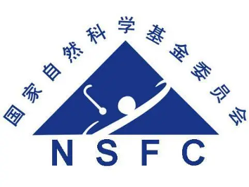
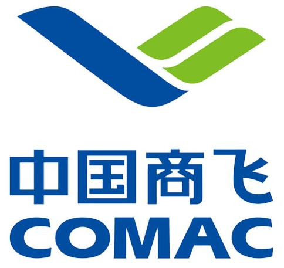
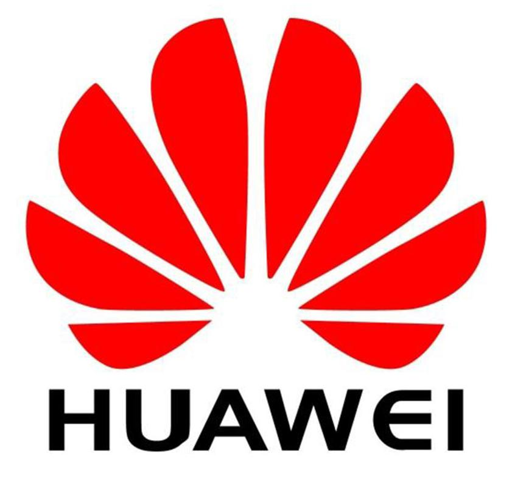
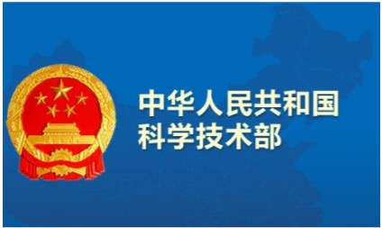
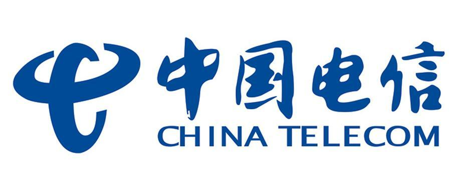
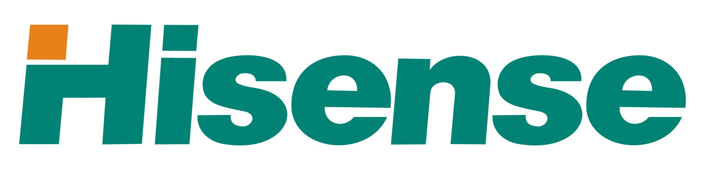

---
# Leave the homepage title empty to use the site title
title:
date: 2022-10-24
type: landing

sections:
  - block: contact
    content:

      text: |-

        
MediaX thanks national research programs and our industrial partners for their support.

        
        <!DOCTYPE html>
        <html lang="zh-CN">
        <head>
            <meta charset="UTF-8">
            <title>商标集合展示</title>
            
        </head>
        <body>
            

                
                
                
                
                
                
                
                
                
                 
            

        </body>
        </html>

    design:
        columns: '1'

  - block: contact
    content:

      text: |-

        <html lang="en">
        <head>
            <meta charset="UTF-8">
            <meta name="viewport" content="width=device-width, initial-scale=1.0">
            <title>News</title>
            
        </head>
        <body>
            

                

                    <h1>🔥 News: </h1>
                

                

                    
[2025/6]   Two paper is accepted to ICCV 2025

                    
[2025/5]   One paper is accepted to ICML 2025

                    
[2025/3]   Two paper is accepted to ICME 2025

                    
[2025/2]   Two paper is accepted to CVPR 2025

                    
[2025/2]   NTIRE 2025 XGC Quality Assessment Challenge Organizer

                    
[2025/1]   One paper is accepted to JSAC 2025

                    
[2024/12]  One paper is accepted to AAAI 2025

                    
[2024/7]   One paper is accepted to TCSVT 2024

                    
[2024/7]   One paper is accepted to ACM MM 2024

                    
[2024/6]   One paper is accepted to ICIP 2024

                

            

        </body>
        </html>
      
    design:
        columns: '1'

---