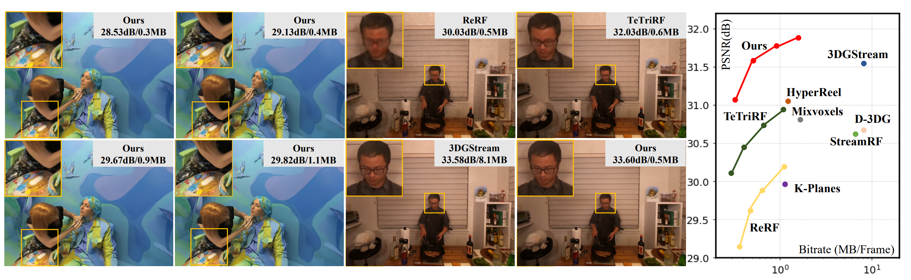
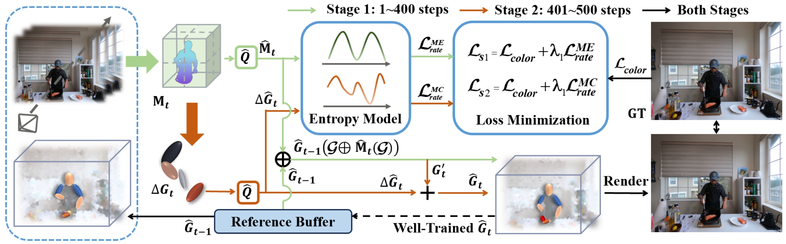
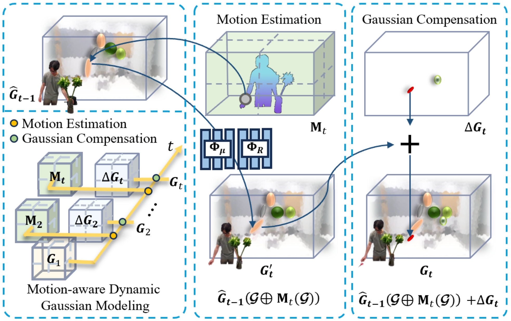
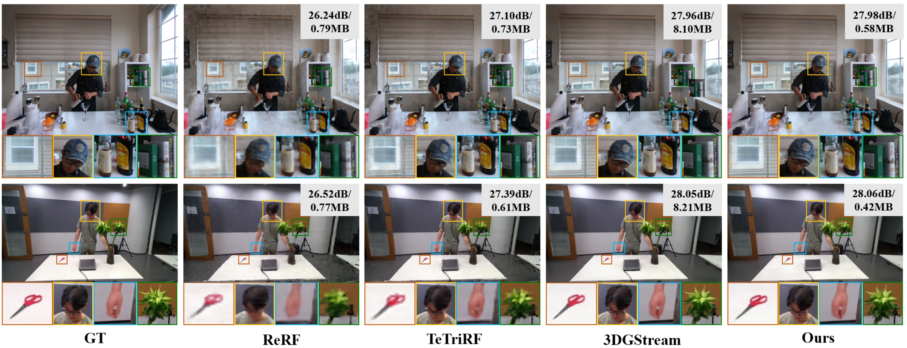
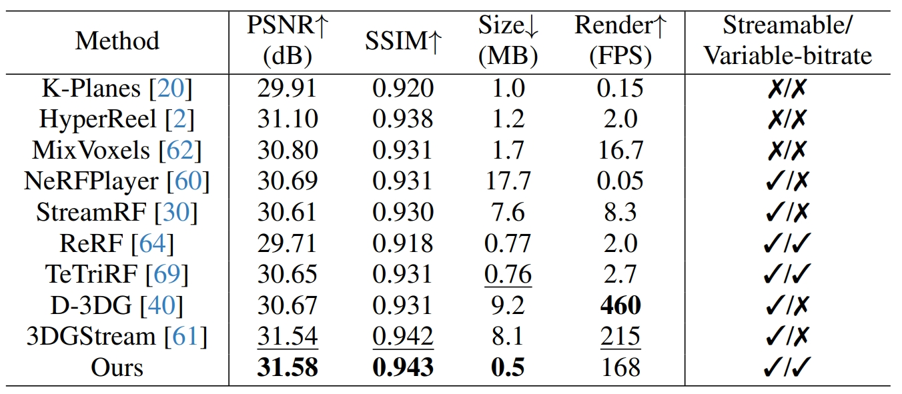
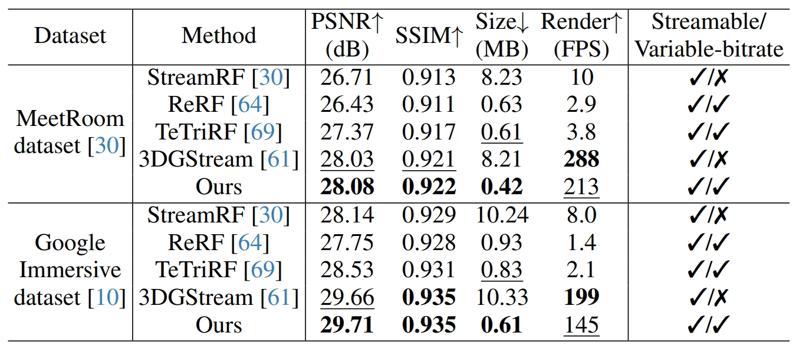
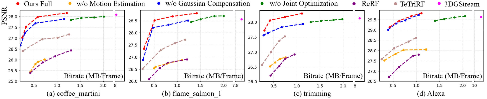
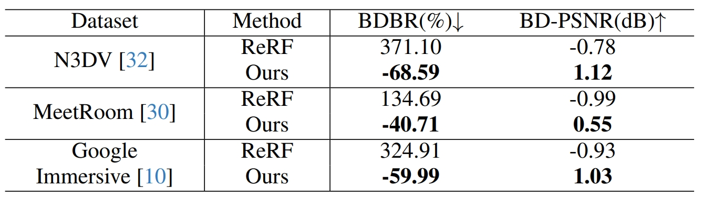
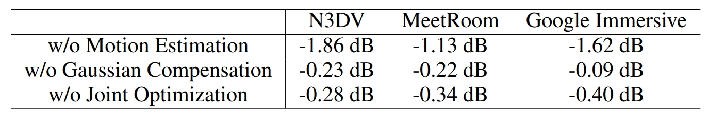

---
title: CVPR2025｜16倍压缩！4DGC 让高质量自由视点视频流式传输成为现实（代码已开源）
date: 2022-10-24
type: landing

sections:
  - block: contact
    content:

      text: |-
        <link rel="stylesheet" href="https://cdn.jsdelivr.net/npm/katex@0.16.4/dist/katex.min.css">
        <!-- 引入KaTeX渲染脚本 -->
        
        <!-- 引入自动渲染工具（可选，自动处理文档中的公式） -->
        

        

        # CVPR2025｜16倍压缩！4DGC 让高质量自由视点视频流式传输成为现实（代码已开源）

        > **文章标题**：4DGC: Rate-Aware 4D Gaussian Compression for Efficient Streamable Free-Viewpoint Video  
        > **作者团队**：Qiang Hu, Zihan Zheng, Houqiang Zhong, Li Song, XiaoyunZhang, Guangtao Zhai, Yanfeng Wang  
        > **来源**：CVPR 2025  
        > **文章地址**：https://arxiv.org/abs/2503.18421   
        > **视频链接**：https://www.bilibili.com/video/BV1N7VbzrEt1     
        > **项目主页**：https://waveviewer.github.io/4dgc/   
        > **代码地址**：https://github.com/qianghu-huber/4DGC  
        > **内容整理**：钟后强  
        > **摘要**：3D高斯泼溅技术 (3DGS) 在实现逼真的自由视点视频 (FVV) 体验方面拥有巨大潜力。然而，大量的高斯点云数量及其相关属性对存储和传输提出了严峻挑战。现有方法通常分别处理动态 3DGS 表示和压缩，忽略了训练过程中的运动信息和码率失真 (RD) 权衡，导致性能下降和模型冗余增加。为了弥补这一缺陷，我们提出了 4DGC，这是一种新颖的码率感知 4D 高斯压缩框架，它可以显著减少存储大小，同时保持 FVV 卓越的 RD 性能。具体而言，4DGC 引入了一种运动感知的动态高斯表示，该表示利用紧凑的运动网格与稀疏补偿高斯函数相结合来挖掘帧间相似性。这种表示能够有效地处理大运动，保持质量并减少时间冗余。此外，我们提出了一种端到端压缩方案，该方案采用可微量化和微小隐式熵模型来高效压缩运动网格和补偿高斯分布。整个框架通过率失真权衡进行联合优化。大量实验表明，4DGC 支持可变比特率，并且在多个数据集的 RD 性能上始终优于现有方法。 

        ## 引言
        自由视点视频（Free-Viewpoint Video, FVV）技术，让用户能够像在现实世界中一样，从任意角度实时探索动态三维场景，为虚拟现实、体育直播和沉浸式娱乐带来了无限可能。近年来，3D高斯泼溅（3DGS）技术凭借其卓越的渲染质量和速度，在静态场景重建上取得了巨大成功。然而，当3DGS走向动态场景，一个巨大的挑战浮出水面：数据量爆炸。海量的高斯点云及其随时间变化的属性（位置、颜色、旋转等）对存储和网络传输构成了严峻的考验。现有方法往往将场景表示和数据压缩视为两个独立步骤，忽略了二者之间的内在联系，导致压缩效率低下，难以支持真正意义上的高质量“流式”传输。

        为了攻克这一难题，来自上海交通大学的研究者们提出了 **4DGC**，一个新颖的**码率感知4D高斯压缩框架**。该框架巧妙地将场景表示与压缩过程进行端到端联合优化，在大幅降低数据量的同时，保持渲染质量，为高效的FVV流媒体应用铺平了道路。

        ## 现有方法的挑战

        实现高质量的动态FVV流式传输主要面临以下瓶颈：

        - **传统方法的真实感不足**：依赖于点云和深度图的传统FVV技术，在面对复杂场景时难以渲染出令人信服的高真实感画面。
        - **神经辐射场（NeRF）的效率困境**：NeRF及其变体虽然提升了真实感，但普遍存在训练和渲染速度慢、难以支持长序列、流式传输困难等固有缺陷。即便是像TeTriRF这样通过压缩显式特征来改进的方法，其效率问题依然显著。
        - **动态3DGS的“流量”焦虑**：早期的动态3DGS扩展方案，虽然引入了时间维度，但通常需要一次性加载整个场景的数据，这对于流式应用是不可行的。即便是像3DGStream这样通过神经变换来建模帧间运动的方法，其整体数据量依然庞大，制约了传输效率。更关键的是，这些方法在设计表示模型时并未考虑“码率-失真”的权衡，导致最终的压缩性能远未达到理论最优。

        ## 主要贡献

        本文提出面向高斯表征的率感知压缩方法4DGC，其核心创新在于：1）建立运动感知的动态高斯表征，通过关键帧初始化参考高斯体，利用紧凑多分辨率运动网格估计帧间刚性运动，并稀疏添加补偿高斯体处理新增区域；2）设计端到端联合压缩方案，采用可微分量化与轻量熵模型对初始球谐系数、运动网格及补偿高斯进行编码，通过率失真联合优化显著提升压缩性能。实验表明，4DGC在保持质量不变的情况下较3DGStream实现约**16倍**压缩率提升，在训练速度、渲染质量和码率效率方面全面超越现有方法。

        **本文的主要贡献如下**：

        - 提出支持流式传输的紧凑4D高斯表征，通过运动建模与动态补偿有效消除时序冗余
        - 构建端到端压缩框架，通过率失真联合优化实现低熵表征
        - 在真实场景数据集上验证了方案在重建质量、码率效率和渲染速度的全面优势

        ## 方法
        

        如图展示我们 4DGC 的整体架构。我们的方法首先构建了一个运动感知的动态高斯表示，由一个紧凑的运动网格和稀疏补偿高斯组成。随后，我们提出一种结合运动估计与运动补偿的两阶段方法，以生成该表示，能够有效捕捉空间和时间的变化。最后，我们提出一个端到端压缩方案，联合优化表示和熵模型，从而确保低熵表示并显著提升码率-失真性能。

        ### 运动感知的动态高斯建模
        

        回顾 3DGS，其使用高斯元集合 $\mathbf{G}$ 对场景进行显式建模，类似于点云。每个高斯 $\boldsymbol{\mathcal{G}} \in \mathbf{G}$ 由参数集合 $\{ \boldsymbol{\mu}; \mathbf{R}; \mathbf{f}; \mathbf{s};\alpha \}$ 定义，其中 $\boldsymbol{\mu}$ 是中心位置，$\mathbf{R}$ 是旋转矩阵，$\mathbf{f}$ 是用于视角相关颜色 $\mathbf{c}$ 的 SH 系数，$\mathbf{s}$ 是缩放向量，$\alpha$ 是不透明度。对于处于高斯元内部的位置 $\mathbf{x}$，其空间分布由下式定义：

        $$
        \boldsymbol{\mathcal{G}}(\mathbf{x}) = \exp\left(-\frac{1}{2}(\mathbf{x}- \boldsymbol{\mu})^T\mathbf{\Sigma}^{-1}(\mathbf{x}-\boldsymbol{\mu})\right)
        $$

        其中 $\mathbf{\Sigma} = \mathbf{R}\mathbf{s}\mathbf{s}^T\mathbf{R}^T$。
        像素的颜色 $\mathbf{c}$ 通过对重叠的 $N$ 个高斯按照深度顺序进行 alpha 混合获得：

        $$
        \mathbf{c} = \sum_{i \in N} \mathbf{c}_i {\alpha'}_{i} \prod_{j=1}^{i-1} (1 - {\alpha'}_j)
        $$

        其中 $\alpha_i'$ 是第 $i$ 个高斯在图像平面上的投影不透明度，$\mathbf{c}_i$ 是该高斯在当前视角下的颜色。为了从静态场景扩展到动态场景，一种直观的方法是叠加逐帧的静态高斯来构成动态序列，但这忽略了时间一致性，会造成显著的时间冗余。已有方法如SpacetimeGS和4DGS将高斯扩展到 4D 空间来建模整个动态场景，但在长序列中会导致性能退化，且不适用于流式应用。为克服这些问题，我们提出一种运动感知的动态高斯表示，明确建模并跟踪相邻帧之间的运动，以维持空间和时间的一致性。我们使用完整的 3DGS 表示作为第一帧的初始高斯 $\mathbf{G}_1$ $\mathbf{G}_1$ 。在后续帧中，我们采用多分辨率的运动网格 $\mathbf{M}_t$ ，并通过两个共享的轻量级 MLP（$\Phi_{\boldsymbol{\mu}}$ 和 $\Phi_{\mathbf{R}}$ ）预测每个高斯的刚性运动。运动网格具有多尺度特性，能够精准建模不同速度或方向的物体运动。对于新出现的区域，我们动态添加稀疏补偿高斯 $\Delta \mathbf{G}_t$ 。最终，我们用 $\mathbf{G}_1, \{\mathbf{M}_t, \Delta \mathbf{G}_t\}_{t=2}^{N}$ 、$\Phi_{\boldsymbol{\mu}}$ 和 $\Phi_{\mathbf{R}}$ 来顺序建模整个动态场景。该设计显著降低时间冗余，并提升重建质量。

        ### 序列化表征生成

        我们提出一种结合“运动估计”与“运动补偿”的两阶段方案，以生成高质量的动态高斯表示，能够准确捕捉场景在空间和时间上的变化。

        **运动估计模块**

        我们从参考缓冲区加载前一帧的重建高斯 $\hat{\mathbf{G}}_{t-1}$，并结合当前帧的图像输入，通过多分辨率运动网格 $\mathbf{M}_t$ 及 MLP $\Phi_{\boldsymbol{\mu}}, \Phi_{\mathbf{R}}$ 预测每个高斯的平移与旋转变换。前一帧每个高斯的位置编码如下：

        $$
        \mathbf{P}_{t-1} = \{\mathbf{P}_{t-1}^l\}_{l=1}^L = \{\sin(2^l\pi \boldsymbol{\mu}_{t-1}), \cos(2^l\pi \boldsymbol{\mu}_{t-1})\}_{l=1}^L
        $$

        我们结合位置编码与运动网格进行插值与预测：

        $$
            \Delta \boldsymbol{\mu}_t = \Phi_{\boldsymbol{\mu}} (\bigcup_{l=1}^L \text{interp}(\mathbf{P}_{t-1}^l, \mathbf{M}_{t}^l) )
        $$

        $$
            \Delta \mathbf{R}_t = \Phi_{\mathbf{R}}\left(\bigcup_{l=1}^L \text{interp}(\mathbf{P}_{t-1}^l, \mathbf{M}_{t}^l)\right)
        $$

        最终将变换应用于新一帧的高斯：

        $$
            \mathbf{G}_{t}^{'} =  \hat{\mathbf{G}}_{t-1}(\boldsymbol{\mathcal{G}} \oplus \mathbf{M}_t(\boldsymbol{\mathcal{G}})) \\
            = \{ \boldsymbol{\mathcal{G}}(\boldsymbol{\mu}_{t-1}+ \Delta \boldsymbol{\mu}_t; \Delta \mathbf{R}_t \mathbf{R}_{t-1} ; C ) \mid \boldsymbol{\mathcal{G}} \in \hat{\mathbf{G}}_{t-1}\}
        $$

        **运动补偿模块**

        由于运动估计无法覆盖新出现物体和细节，为此我们在估计不足区域添加补偿高斯 $\Delta \mathbf{G}_t$。不充分区域包括：(1) 梯度剧变区域（通过阈值 $\tau_g$ 检测），(2) 大高斯经历剧烈运动（用阈值 $\tau_\mu$ 和 $\tau_R$ 判断是否克隆两个缩小的高斯，比例为 $1/100$）。这些补偿高斯从原高斯的 $\mathcal{N}(\boldsymbol{\mu}, 2 \boldsymbol{\Sigma})$ 中采样，并在第二阶段优化。这样增强了动态细节的表示能力。

        ### 端到端联合压缩

        我们提出一个端到端的 4D 高斯压缩框架，通过联合优化表示与熵模型实现高效压缩。整个训练分为两个阶段：

        **阶段一：运动网格压缩**

        优化 $\Phi_{\boldsymbol{\mu}}$、$\Phi_{\mathbf{R}}$、$\mathbf{M}_t$ 及其熵模型，损失函数为：

        $$
        \mathcal{L}_{s1} = \mathcal{L}_{color} + \lambda_1 \mathcal{L}_{rate}^{ME} \\
        \mathcal{L}_{rate}^{ME} = -\frac{1}{N} \sum_{\hat{y} \in \hat{\mathbf{M}}_t} \log_2(P_{PMF}^1(\hat{y}))
        $$

        **阶段二：补偿高斯压缩**
        优化 $\Delta \mathbf{G}_t$ 及其熵模型，重点压缩 SH 系数。损失函数为：

        $$
        \mathcal{L}_{s2} = \mathcal{L}_{color} + \lambda_1 \mathcal{L}_{rate}^{MC} \\
        \mathcal{L}_{rate}^{MC} = -\frac{1}{M} \sum_{\hat{y} \in \hat{\mathbf{f}}_t^C} \log_2(P_{PMF}^2(\hat{y}))
        $$

        最终，重建帧表示为：

        $
        \hat{\mathbf{G}}_t = \hat{\mathbf{G}}_{t-1}(\boldsymbol{\mathcal{G}} \oplus \hat{\mathbf{M}}_t(\boldsymbol{\mathcal{G}})) + \Delta \hat{\mathbf{G}}_t
        $,$\hat{\mathbf{G}}_t$ 被用于下一帧的重建过程。

        ## 实验

        **数据集：** N3DV、MeetRoom 和 Google Immersive 多视角视频数据集

        ### 表征质量-模型大小性能比较
        我们的方法在重建质量上与 3DGStream 相当，但所需码率显著更低，实现了超过 **16**倍 的压缩率。与 ReRF和 TeTriRF  相比，我们的 4DGC 更有效地保留了诸如 coffee_martini 场景中的头部、窗户、瓶子和书籍，以及trimming场景中的人脸、手部、植物和剪刀等细节，这些细节在其他两种方法的重建结果中均有所丢失。这表明，我们的 4DGC 能够准确捕捉动态场景中的关键元素，并在保持极致紧凑模型体积的同时，实现对精细物体结构的高质量还原。
        

        为验证我们方法的有效性，我们将其与多种最新的先进方法进行定量对比，包括 K-Planes 、HyperReel、MixVoxels、NeRFPlayer、StreamRF、ReRF、TeTriRF、D-3DG 以及 3DGStream。如定量评估表所示，在 N3DV 数据集上我们的方法在重建质量和码率方面均优于现有方法，取得了最佳的重建性能，并显著降低了所需的比特率。3DGStream 在达到与我们方法相近的重建质量时需消耗 **8.1 MB**，而我们的 4DGC 仅需**0.5 MB**。尽管 TeTriRF在码率上接近，但由于其将表示与压缩分离优化，导致重建质量较差。相比之下，我们的方法通过率-失真联合优化框架，在保持高重建质量的同时显著提升了压缩性能。
        

        为进一步验证方法的通用性，我们还在 MeetRoom 和 Google Immersive 数据集上进行实验，并与 StreamRF、ReRF、TeTriRF 和 3DGStream进行了定量对比，结果如表所示。在 PSNR、SSIM 和码率方面，我们的方法依然优于其他方法。
        

        ### 率失真性能

        我们方法在三个数据集的多个序列中与 ReRF、TeTriRF 和 3DGStream的 RD 曲线对比。可以明显看出，4DGC 在广泛的码率范围内始终表现出最优的率-失真性能。
        

        此外，我们还计算了相对于 ReRF 和 TeTriRF 的 BDBR（比特率节省），结果如表 所示。在 N3DV 数据集上，我们的方法相比 TeTriRF 平均减少了 **68.59%** 的 BDBR。在 MeetRoom 和 Google Immersive 数据集上，也分别达到了 **40.71%** 和 **59.99%** 的节省。与 ReRF 相比，我们的方法同样展现出显著更优的 RD 表现。
        

        ### 时间复杂度
        通过与主流动态场景压缩方法 ReRF 和 TeTriRF 的直接对比，4DGC 在训练、渲染和编解码的各个环节都展现出速度优势。在训练时间方面，4DGC 仅需 0.83 分钟，而 ReRF 和 TeTriRF 分别需要 42.73 分钟和 1.04 分钟；在渲染方面，4DGC 仅需 **0.006** 秒（约168FPS），远优于 ReRF（0.502 秒）和 TeTriRF（0.375 秒）；在编码和解码方面，4DGC 分别只需 **0.72** 秒和 **0.09**秒，同样优于其它方法。

        ### 消融实验
        我们设计了三组消融实验，以评估运动估计、运动补偿以及表示与压缩的联合优化这三个关键模块的有效性。具体而言，我们在训练过程中分别关闭每个模块，观察其对性能的影响。在第一组实验中，我们仅保留运动估计，去除运动补偿模块；在第二组实验中，我们不使用运动估计，仅基于前一帧训练每一帧的补偿高斯；在第三组实验中，我们将运动感知表示与熵模型分开训练，而非进行联合优化。RD 曲线图表明：无论禁用运动估计、运动补偿，还是取消联合优化，都会导致在不同码率下的率-失真性能下降。

        此外，下表所示的三组实验相较于完整 4DGC 框架所获得的负向 BD-PSNR 值进一步验证了我们方法在动态场景压缩中的有效性。
        

        ## 结论

        本文提出了一种专为基于4D高斯的自由视点视频（FVV）设计的率感知压缩框架——4DGC 。通过创新的**运动感知4D高斯表征**，该方法能够高效捕捉帧间动态与空间细节，同时显著降低时序冗余 。我们构建的**端到端联合压缩方案**，巧妙地结合了隐式熵模型与率失真权衡，不仅支持灵活可变码率的流式传输，更通过一体化优化大幅提升了压缩性能 。实验结果表明，4DGC 不仅实现了当前最顶尖的率失真性能，还能自适应调整码率以匹配不同网络环境，在有效降低 AR/VR 等场景的存储与带宽需求的同时，为用户带来了高真实感的沉浸式 FVV 应用体验 。

---