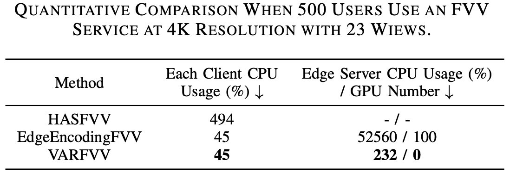

---
title: JSAC 2025｜VARFVV让你在手机上畅玩超高清实时自由视点视频
date: 2022-10-24
type: landing

sections:
  - block: contact
    content:

      text: |-
         <link rel="stylesheet" href="https://cdn.jsdelivr.net/npm/katex@0.16.4/dist/katex.min.css">
         <!-- 引入KaTeX渲染脚本 -->
         
         <!-- 引入自动渲染工具（可选，自动处理文档中的公式） -->
         

         
         # JSAC 2025｜VARFVV让你在手机上畅玩超高清实时自由视点视频
         > **题目**：VARFVV: View-Adaptive Real-Time Interactive Free-View Video Streaming with Edge Computing  
         > **作者**：Qiang Hu, Qihan He, Houqiang Zhong, Guo Lu, Xiaoyun Zhang, Guangtao Zhai, Yanfeng Wang   
         > **来源**：IEEE JSAC 2025  
         > **文章地址**：https://arxiv.org/abs/2501.13630  
         > **视频链接**：https://www.bilibili.com/video/BV1ntLnzUEtJ  
         > **项目主页**：https://waveviewer.github.io/VARFVV/  
         > **内容整理**：钟后强 
         > 自由视角视频（FVV）允许用户从多个视角探索沉浸式视频内容。然而，由于视角切换的不确定性，以及传输和解码多个视频流所需的大量带宽和计算资源，FVV 的传输面临重大挑战，这可能导致频繁的播放中断。现有的方法，无论是基于客户端还是基于云端，在带宽和计算资源受限的条件下都难以满足高质量体验（QoE）的要求。为了解决这些问题，我们提出了 VARFVV，这是一种带宽和计算效率高的系统，能够实现高QoE和低切换延迟的实时交互式FVV流传输。具体而言，VARFVV 引入了一种低复杂度的 FVV 生成方案，在边缘服务器上根据用户选择的视角轨迹重新组装多视角视频帧，从而无需转码，显著降低了计算开销。这种设计特别适用于大规模、基于移动端的超高清视频（UHD）FVV体验。此外，我们提出了一种基于图神经网络的流行度自适应比特分配方法，该方法可以预测视角的受欢迎程度，并在带宽受限的情况下动态调整比特分配，以最大化 QoE。我们还构建了一个包含 10 个场景（如篮球、歌剧等）共 330 个视频的 FVV 数据集。大量实验结果表明，VARFVV 在视频质量、切换延迟、计算效率和带宽使用方面均优于现有方法，支持单个边缘服务器同时服务超过 **500** 名用户，视角切换延迟仅为 **71.5** 毫秒。

         ## 引言

         交互式自由视角视频（FVV）使用户能够如同身临其境般自由选择观看角度。FVV 通过多台紧密排列、时间同步的摄像机捕捉动态三维场景，并将数据编码为多个视频流，以呈现全景画面。这项技术能够实现沉浸式的实时直播，支持平滑的视角切换和动态的子弹时间效果，因而在演唱会、体育赛事和互动教学等大规模直播场景中展现出广阔的应用前景。然而，在移动网络上传输 FVV 面临诸多挑战，包括视频质量、视角切换延迟、传输带宽和计算资源等方面的问题，而这些因素往往相互冲突。实现高质量视频需要更高的带宽和处理能力，以完成视频流的加载、解码和渲染等任务。然而，移动网络与设备本身的带宽和处理能力存在固有限制，尤其在带宽受限或资源紧张的环境下尤为突出。随着视频质量的提升（如更高码率或分辨率），所需的传输带宽也成比例增加，容易造成网络拥堵与播放中断。此外，频繁的视角切换要求系统能够实时加载、解码与渲染数据，给服务器和终端设备带来巨大的计算压力，从而导致延迟增加，用户体验下降。仅优化单一方面（例如减少带宽使用或降低切换延迟）会损害视频质量或增加计算负担，从而加剧系统性能问题。这些复杂的权衡关系表明，必须开发有效策略，在各种冲突因素之间取得平衡，确保 FVV 在移动网络中的无缝高效传输。

         

         为此，本文提出了一种全新的基于边缘计算的视角自适应实时交互式自由视角视频流系统（VARFVV），如图1所示。该系统在实现低视角切换延迟与高 QoE 的同时，也大幅降低了计算与传输成本。我们提出的创新点包括两大核心设计：1）首先，我们设计了一种低复杂度的 FVV 生成方案，能够在边缘服务器上根据用户选择的视角轨迹重新组装多视角视频帧，无需进行传统转码操作。相比基于转码的云端方法，该方案大幅加快了视频生成速度。组装完成的 FVV 流通过 WebRTC 实时传输给用户，实现极低的传输延迟。由于只需向客户端传输一条重组的视频流，VARFVV 显著减少了传输带宽和服务端/客户端的计算负载，使系统能高效支持大量用户在移动设备上同时享受高质量的超清 FVV 实时服务。2）其次，为进一步在受限码率条件下提升 QoE，我们引入了一种基于流行度自适应的比特分配策略。我们首先构建了一个面向 QoE 的优化模型，目标是最大化用户体验。为求解该问题，我们提出了一种基于图神经网络（GNN）的视角流行度预测方法，将每个视角建模为图中的一个节点，视角间的切换行为作为边连接节点，进而推测各视角的受欢迎程度。基于该预测结果，我们设计了一种新颖的比特分配方案，通过从冷门视角“借”比特分配给热门视角，以动态调整编码质量。此自适应策略优化了用户最常观看视角的视频质量，在有限带宽内最大化整体视觉体验，有效提升系统的 QoE 水平。

         **本文的主要贡献如下**：

         - 提出 VARFVV 系统，在带宽和计算资源有限的条件下，实现了高 QoE、低切换延迟的实时交互式 FVV 流传输，具备良好的可扩展性，适用于真实场景中的沉浸式服务交付。

         - 提出了一种无需转码、基于重组的视频生成方法，极大降低了边缘服务器的计算负担。实验表明，一台搭载 AMD Ryzen 7 3700 CPU@3.6 GHz 的边缘服务器可支持超过 **500** 名用户同时观看 FVV。

         - 构建了一个时空图神经网络，用于预测视角流行度，并基于此提出了流行度驱动的比特分配算法，在保证整体带宽约束的前提下，优化热门视角的视频质量，从而提升整体用户体验。

         ## 方法
         

         我们 VARFVV 的整体架构如图2所示。VARFVV 系统旨在通过集成多视角编码、基于流行度的自适应比特分配、边缘侧 FVV 流生成以及客户端解码，构建一个统一架构从而以提供高质量、实时的自由视角视频（FVV）服务。系统使用一组时间同步的 ZCAM 摄像机从多个视角采集动态三维场景，并通过  H.264 编码器在**多视角编码器模块**中对各个视角进行编码。每个视角被编码为两种格式：用于快速视角切换的视角切换表示（$S_i$）和用于稳定观看体验的视角常态表示（$C_i$）。这种双编码方式为连续、无缝的视角切换提供了基础保障。为了优化用户的观看体验（QoE），系统在云端服务器上引入了基于流行度的比特自适应分配算法。其中，**流行度预测模块**通过分析有限的历史用户交互数据，采用图神经网络预测未来各个视角的受欢迎程度。根据每个视角的预测流行度，**比特分配模块**会定期更新多视角编码器的比特率设置。该策略通过从感知上不重要的视角中更积极地“借用”比特资源，并将其分配给热门视角，从而在带宽受限的情况下提升整体 FVV 视频质量。边缘侧的 FVV 生成机制是系统减少视角切换延迟、降低传输和计算开销的关键所在。**同步模块**根据视频帧的显示时间戳（PTS）对多视角帧进行对齐，以确保精确同步。当用户与系统交互（如滑动或切换视角）时，**帧选择**与**帧重组**模块会根据用户选定的视角轨迹，动态选择并重新组合合适的帧，生成新的 FVV 流。由于系统仅对视频帧进行重组而非转码，因此能保持极低的计算开销。生成的 FVV 视频流通过 WebRTC 技术传输至客户端，确保低延迟的传输效果与用户操作的即时响应。客户端的解码模块在本地处理接收到的视频流，并根据需要向服务器发送交互信号。得益于 VARFVV 的设计，用户可在移动网络环境中高效地通过移动设备享受高质量的超清 FVV 实时服务。

         ### 基于双编码的FVV视频流生成模块
         在传统的基于云端的传输系统中，每当用户请求视频时，服务器都会对视频流进行重新编码，导致大量的计算开销。为缓解这一问题，我们提出了一种低复杂度的 FVV 流生成方案，该方案在边缘服务器上根据用户选择的视角路径，对多视角视频流中的 I 帧与 P 帧进行重组。在视频编码中，I 帧可以独立解码，而 P 帧则依赖于之前的 I/P 帧进行解码。因此，在切换视角时，系统必须等待新视角的 I 帧出现，若 I 帧间隔较长，则会造成明显的切换延迟，影响用户体验。为了实现低延迟的随机访问视角切换，可以在视频采集阶段对多视角视频进行高密度 I 帧编码。然而，由于在相同质量下 I 帧比 P 帧需要更多比特，若用户长时间保持视角不变，则传输大量 I 帧会造成带宽浪费。

         为解决上述矛盾，我们在视频采集阶段提出一种双编码策略：每个视角 $v_i$（$1\leq i\leq N$）被编码为两种表示，如图3所示：
         一种是视角切换表示（view-switching representation），记为 $S_i$，采用固定 GoP（Group of Pictures）长度为 2（$\hat{g}_{i,j}=2$），用于频繁切换视角的场景；
         另一种是视角常态表示（view-constant representation），记为 $C_i$，采用固定 GoP 长度为 25（$g_{i,j}=25$），适用于视角保持稳定的情况。
         

         编码完成后，多视角视频流被传输至边缘服务器，并根据用户的视角轨迹动态重组。当用户当前在第 $j$ 个视频片段中固定于视角 $v_i$ 时，边缘服务器会直接从 $C_{i,j}$ 中提取压缩帧作为输出，发送给用户。如果用户从 $v_i$ 切换至 $v_m$，则边缘服务器会立即从 $S_{i+1,j}$ 到 $S_{m,j}$ 中选择时间连续的 I 帧，按时间顺序拼接生成新的 FVV 视频流并传输给用户。切换完成后，服务器继续从 $S_{m,j}$ 中提取帧作为输出，直到遇到 $C_{m,j}$ 中的一个时间同步的 I 帧，此时便切换回使用 $C_{m,j}$ 中的视频帧。

         该流程实现了连续、无缝且快速的视角切换，同时几乎不会增加额外的计算复杂度。值得一提的是，为进一步减少切换延迟，当 $i$ 为偶数时，我们在 $S_{i,j}$ 的起始位置插入一个 I 帧，使相邻视角切换表示中的 I 帧错峰排列，从而有效降低视角切换延迟。

         ### QoE感知的比特分配优化建模

         我们旨在在有限带宽资源下，通过为每个视频片段 $j$ 中的各视角分配比特率，最大化用户的观看体验（QoE）。令 $R_{i,j}$ 和 $\hat{R}_{i,j}$ 分别表示视角 $C_i$ 和 $S_i$ 在第 $j$ 个视频片段中的比特分配，其中 $i\in\{1,2,\cdots,N\}$。我们将该视频片段下的总 QoE 定义为：
         $$
            \mathbf{QoE_j}(R_{1,j},\dots,R_{N,j},\hat{R}_{1,j},\dots,\hat{R}_{N,j}) = 
            \mathbf{QoE_{1,j}}  -  \mu_1 \mathbf{QoE_{2,j}}  - \mu_2 \mathbf{QoE_{3,j}}
         $$
         其中，$\mathbf{QoE_{1,j}}$ 表示视频质量体验约束，$\mathbf{QoE_{2,j}}$ 表示视角切换质量波动约束，$\mathbf{QoE_{3,j}}$ 表示时序一致质量约束，$\mu_1$ 和 $\mu_2$ 为权重因子。

         **视频质量体验约束**
         我们采用对数模型来刻画 QoE 与比特率的关系：$\mathbf{QoE_{1,i,j}} = \log(1+R_{i,j}/\eta)$。其中 $\eta$ 是模型参数。考虑全部视角切换与常态表示，视频质量的 QoE 表达式为：
         $$
         \mathbf{QoE_{1,j}} = \sum_{i=1}^{N} x_{i,j}\log(1+R_{i,j}/\eta )+\sum_{i=1}^{N} \hat{x}_{i, j}\log(1+\hat{R}_{i,j}/\hat{\eta} )
         $$
         其中 $x_{i,j}$ 和 $\hat{x}_{i,j}$ 表示第 $j$ 段视频中 $C_i$ 和 $S_i$ 的视角流行度，$\hat{\eta}$ 为另一模型参数。由于这两个流行度值事先未知，我们利用历史视角请求预测其值，记为 $p_{i,j}$ 和 $\hat{p}_{i,j}$。代入后，公式变为：
         $$
         \mathbf{QoE_{1,j}} = \sum_{i=1}^{N} p_{i,j}\log(1+R_{i,j}/\eta )+\sum_{i=1}^{N} \hat{p}_{i,j}\log(1+\hat{R}_{i,j}/\hat{\eta} )
         $$

         **视角切换质量波动约束**
         视角切换时，由于不同视角可能被以不同码率编码，视频质量会出现突变，从而影响观看体验。为衡量并限制这种变化，定义如下指标：
         $$
         \mathbf{QoE_{2,j}} = \mu_3 \sum_{i=2}^{N}\hat{p}_{i,j}(\hat{R}_{i,j}-\hat{R}_{i-1,j})^2 + \sum_{i=2}^{N}\hat{p}_{i,j}(\hat{R}_{i,j}/\hat{\eta}-R_{i-1,j}/\eta)^2    
         $$
         第一项衡量连续视角切换表示之间的码率差异，第二项衡量常态表示与切换表示间的质量过渡，$\mu_3$ 为加权因子。

         **时序一致质量约束**
         当用户保持固定视角时，连续视频片段间码率波动也会影响体验，特别是在沉浸式环境中可能引发眩晕等不适。为量化该问题，定义如下指标：
         $$
         \mathbf{QoE_{3,j}} = \sum_{i=1}^{N}p_{i,j}(R_{i,j}-R_{i,j-1})^2
         $$

         **优化问题建模**
         最终的 QoE 感知比特分配优化问题建模如下：
         $$
         \mathbf{arg \ max} \quad \mathbf{QoE_j}(R_{1,j},\dots,R_{N,j},\hat{R}_{1,j},\dots,\hat{R}_{N,j}) \\
         \mathbf{s.t.} \quad \sum_{i=1}^{N} R_{i,j} + \hat{R}_{i,j} \le R_j \\
         \qquad R_{\mathbf{min}} \le R_{i,j} \le R_{\mathbf{max}}, \quad \hat{R}_{\mathbf{min}} \le \hat{R}_{i,j} \le \hat{R}_{\mathbf{max}} 
         $$
         该问题可分为两个阶段：首先预测视角流行度 $p_{i,j}$ 和 $\hat{p}_{i,j}$，随后基于预测结果进行比特分配。值得注意的是，与聚焦于 $360^\circ$ 视频中基于图块的码率优化不同，我们的方案专为 FVV 多视角视频而设计，在视角动态切换场景下提出了新的约束与指标，更契合该场景的 QoE 需求。

         ### 基于图神经网络的视角流行度预测方法
         为实现自适应比特分配，我们提出了一种基于历史数据的新方法，用于预测视角的流行度 $p_{i,j}$ 和 $\hat{p}_{i,j}$。我们将用户视角切换行为分成两类，第一类是**常态视角**，用户在选择偏好视角后通常保持固定观看，很少切换。因此，我们将前一个视频片段中各视角的真实流行度（$x_{i,j-1}$）作为下一个片段的预测值（$p_{i,j}$）。我们将该方法称为“前一帧流行度延续模型（PPC）”。第二类是**视角切换**，由于用户频繁切换关注视角，流行度变化具有高度非线性和复杂性。传统方法如 LSTM 网络能够捕捉时序动态，但未能考虑视角间的空间关系，而这对于准确预测 FVV 中的视角流行度至关重要。我们将 Guo 等人用于交通交叉口预测的注意力机制时空图神经网络（GNN）方法应用于 FVV 的流行度建模，从而同时捕捉时间与空间依赖关系。

         该基于注意力机制的时空 GNN 模型将每个视角建模为图 $G$ 中的一个顶点，视频片段中每个视角的流行度作为对应顶点的属性，如图4所示。对于在摄像机连接关系上相邻的视角，顶点间建立无向边，形成图结构。邻接矩阵 $\mathbf{A}$ 被构建以反映相邻摄像机间的连接关系，从而捕捉视角之间的空间相关性，具体表达如下：
         $$
            G =(V,E,\mathbf{A}) \\
            |V| = N, \quad \mathbf{A} \in \mathbb{R}^{N \times N}
         $$
         其中 $N$ 表示视角总数，$V$ 是顶点集合，$E$ 表示摄像机之间逻辑视角切换所形成的边。对于每一帧，模型在空间维度上对相邻节点的信息进行聚合，同时在时间维度上对相同节点在不同时间点的特征进行聚合。注意力机制使模型能够聚焦于更相关的空间邻居和历史时间步，从而更有效地捕捉空间相关性（如相邻视角）与用户偏好变化等时间动态。该设计保证了模型在用户行为突变等复杂场景下仍具有良好的鲁棒性和预测性能。

         

         ### 基于流行度的自适应比特分配

         在预测出各视角的流行度后，我们为 VARFVV 系统中的每一帧制定了相应的比特分配方案。该方案通过构建拉格朗日函数并结合 KKT 条件，求解 QoE 最大化目标。拉格朗日函数为
         $$
         L(\lambda, R_{1,j},\dots,R_{N,j},\hat{R}_{1,j},\dots,\hat{R}_{N,j}) \nonumber \\
         = \sum_{i=1}^{N} p_{i,j}\log(1+R_{i,j}/\eta )+\sum_{i=1}^{N} \hat{p}_{i, j}\log(1+\hat{R}_{i,j}/\hat{\eta} ) \nonumber \\ 
         - \mu_1 \cdot \mu_3\sum_{i=2}^{N}\hat{p}_{i,j}(\hat{R}_{i,j}-\hat{R}_{i-1,j})^2 \nonumber \\
         - \mu_1 \cdot \sum_{i=2}^{N}\hat{p}_{i,j}(\hat{R}_{i,j}/\hat{\eta}-R_{i-1,j}/\eta)^2 \nonumber \\
         - \mu_2\sum_{i=1}^{N}p_{i,j}(R_{i,j}-R_{i,j-1})^2 \nonumber \\
         + \lambda \left(R_j-\sum_{i=1}^{N}(\hat{R}_{i,j}+R_{i,j})\right)
         $$
         其中，$\lambda$ 是拉格朗日乘子，$R_j$ 表示第 $j$ 个时间片的比特预算，其定义如下：
         $$
         R_j=\frac{R_{avg}\times(N_{coded}+SW)-R_{coded}}{SW} \\
         R_{avg}=R_{tar}\times T_d
         $$
         其中，$R_{tar}$ 是 VARFVV 系统中所有表示的目标码率，$T_d$ 是视频片段的时长。$N_{coded}$ 和 $R_{coded}$ 分别表示已编码的时间片数量及其累计码率消耗。$SW$ 为滑动窗口的大小，用于平滑比特率的动态调节。
         接下来，我们对 Lagrange 函数分别对 $R_{i,j}$ 和 $\hat{R}_{i,j}$ 求偏导，并令其为 0，求解得到 $\lambda$、$R_{i,j}$ 和 $\hat{R}_{i,j}$。

         ## 实验

         **数据集：** 我们构建了一个 VARFVV 数据集(https://github.com/qianghu-huber/VARFVV_Dataset)，包含来自 10 个场景的 330 个视频，包括篮球、歌剧、武术等。我们招募 82 名参与者使用我们的 VARFVV 自由观看这些视频并记录他们的观看轨迹。

         ### 方法有效性评估

         1. **视角预测性能比较**
            图 5 展示了各方法在视角流行度预测任务中的精度累积分布函数。
            

            具体而言，PPC（Previous Popularity Carryover）方法在视角常态场景中表现良好，能够利用前一视频片段的流行度进行有效预测，但在视角频繁切换的场景中表现不佳，因为它无法捕捉用户行为的动态变化。LSTM 虽然能够建模时间动态，在视角切换场景中具有一定效果，但由于无法建模视角之间的空间关系，其整体表现受限。相比之下，GNN 利用图结构同时建模了视角之间的空间相关性和用户行为的时间变化，在用户频繁切换视角时能够更好地适应焦点转移，从而实现更高的预测精度。我们的混合方法综合了 PCC 在视角稳定场景中的优势与 GNN 在动态视角切换场景中的能力，从而在两类场景中都能实现更高的预测准确性。

         2. **用户体验性能比较**
            图 6 展示了各方案下的用户 QoE 测量结果。所有方案在所有表示上使用的总比特数相同。实验表明，我们提出的比特分配策略在高码率和低码率条件下均取得了最佳的 QoE 表现，验证了所提出方法的有效性。相比之下，原始分配方法的表现始终低于其他方法，这是因为流行度自适应比特分配策略能够更积极地从不受欢迎的视角“借用”比特，并将其分配给更受欢迎的视角。
            

         3. **系统时延**
            我们评估了三项对自由视角视频观看体验具有关键影响的延迟指标：启动延迟、视角切换延迟和事件到眼延迟（event-to-eye delay）。启动延迟是指从发送视频流请求到第一帧视频出现在屏幕上的时间。视角切换延迟表示用户发出视角切换请求到所选视角成功显示之间的时间间隔。事件到眼延迟衡量从摄像机捕捉事件开始，到该事件在客户端屏幕上呈现所经历的时间。实验结果表明，VARFVV 系统的平均启动延迟约为 195.1 毫秒，而视角切换延迟更短，仅约为 71.5 毫秒，低于人眼感知的阈值。如图7所示，VARFVV 系统的事件到眼延迟约为 0.51 秒。
            

         ### 对比实验

         1. **FVV性能对比**
            我们将 VARFVV 的性能与三种现有方法进行了对比：ConventionalFVV（客户端接收所有视角视频流）、HASFVV（客户端以 HTTP 自适应流方式接收 10 路视角）、以及 EdgeEncodingFVV （在边缘服务器进行帧转码）。我们从以下几个维度进行性能评估：**峰值信噪比（PSNR）**、**传输码率**、以及包括客户端 CPU、边缘服务器 CPU 和 GPU 在内的**计算资源使用情况**（其中 GPU 使用量指所需 GPU 数量）。我们模拟了 500 名用户同时体验 FVV 的场景，用以评估边缘服务器的计算资源消耗。所有方法均在相同的硬件与软件环境下进行评估，包括边缘服务器和客户端配置。我们根据用户交互程度将测试场景分为低交互和高交互两类。
            

            图 8 展示了在 1080p@25FPS 下，“低交互场景”中 VARFVV 与其他方法的对比结果。与 ConventionalFVV 和 HASFVV 不同，这两种方法需要客户端接收并解码多个视频流，因而需要较高的带宽和较大的 CPU 使用率；而我们提出的 VARFVV 在传输码率和客户端 CPU 开销更低的同时，依然实现了更高的视频质量。此外，相较于 EdgeEncodingFVV，我们的方法在不进行转码的情况下保留了原始视频质量，同时显著降低了计算负担。

            
            图 9 展示了在 1080p@25FPS 下，“高交互场景”中 VARFVV 与其他方法的对比结果。VARFVV 相比 ConventionalFVV 和 HASFVV，在传输码率和客户端 CPU 使用方面表现更优，且视频质量显著更高。虽然在 PSNR 数值上略低于 EdgeEncodingFVV，但在主观观感上保持了相当的视频质量，特别是在快速视角切换时，用户对失真不敏感。此外，为达到相似的视频效果，EdgeEncodingFVV 的计算资源开销远高于 VARFVV。具体而言，我们的单台边缘服务器**无需使用 GPU**，而 EdgeEncodingFVV 则需部署多达 **25 块 RTX4000 显卡**（每块可同时编码最多 20 路 1080p@25fps 视频）以支持 500 名用户。VARFVV 在边缘服务器的 CPU 使用上也更加高效，其使用率为 **153\%**，远低于 EdgeEncodingFVV 的 **4700\%**（主要用于解码操作）。VARFVV 通过连续重组多视角视频帧（无需边缘端解码和转码），使每台服务器能够高效支持多达 **500** 名用户并发访问，显著降低了系统的计算资源需求。

         2. **4K分辨率系统开销对比**
            
            我们在 4K@25FPS 的视频条件下进行了实验，以评估当 500 名用户同时使用 VARFVV、HASFVV 和 EdgeEncodingFVV 时的计算开销。表1展示了实验结果。在客户端 CPU 使用方面，我们的 VARFVV 与 EdgeEncodingFVV 均为 45%，而 HASFVV 高达 494%，这是因为 HASFVV 并未利用边缘服务器进行处理，导致计算负载完全落在客户端。在边缘服务器端，我们的方法在不使用 GPU 的前提下仅占用 232% 的 CPU 资源；相比之下，EdgeEncodingFVV 使用了 100 块 GPU 卡，总 CPU 使用率高达 52560%。这些结果表明，VARFVV 无论在客户端还是边缘服务器端，均具有轻量化和高计算效率的显著优势。

         ## 结论

         我们提出并实现了 VARFVV——一种新型的自由视角视频（FVV）流媒体系统，在保持低计算与传输开销的同时，实现了低视角切换延迟与高用户体验（QoE）的目标。我们提出的高效 FVV 流生成方法通过对视频帧的解复用与重组，显著降低了边缘端的计算负载，使该系统非常适合于面向移动端的大规模超高清视频（UHD）FVV 应用场景。此外，我们还设计了基于 PPC（前一帧流行度延续）与 GNN（图神经网络） 的视角流行度预测算法，以及用于多视角编码的流行度自适应比特分配算法，以在有限码率资源下最大化整体 QoE。大量实验结果表明，我们的方法在视频质量、计算资源使用和传输带宽等方面表现优异，综合性能优于当前主流方法。
---